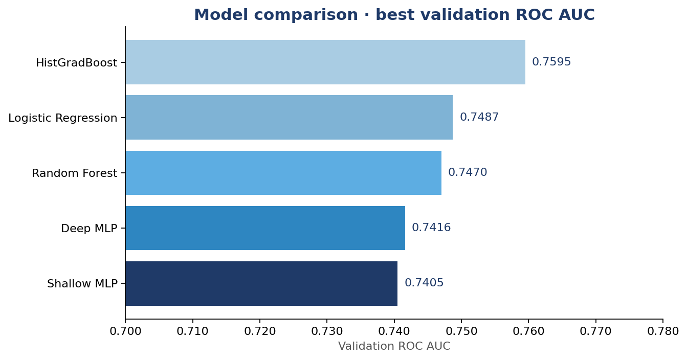
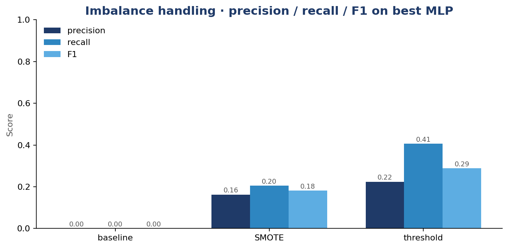

# Loan Default Prediction under Severe Class Imbalance

Comparative study of **classic shallow learners** and **neural networks** on the
[Home Credit Default Risk](https://www.kaggle.com/competitions/home-credit-default-risk/data)
dataset, with a focused look at how each model family responds to class-imbalance
handling techniques.

> **Research question.** *Do classic shallow learners and neural networks respond
> differently to class-imbalance handling techniques?*

## TL;DR

- **HistGradientBoosting wins** on validation ROC AUC (0.7595), narrowly beating
  Logistic Regression (0.7487) and Random Forest (0.7470). Both MLPs trail by
  ~1.5 AUC points.
- For the best MLP, **threshold tuning beats SMOTE oversampling** — it preserves
  ROC AUC and lifts recall from 0% to 41%, while SMOTE drops AUC by ~10 points
  and only reaches 21% recall.
- Take-away: on tabular Home Credit data with 8% positives, **choosing the
  decision threshold matters more than rebalancing the data**, and tree-based
  models retain a meaningful edge over neural networks.



## Dataset

| Property | Value |
| :--- | :--- |
| Source | [Kaggle — Home Credit Default Risk](https://www.kaggle.com/competitions/home-credit-default-risk/data) |
| Train rows | 307,511 |
| Test rows | 48,744 |
| Features | 122 (mix of numeric + categorical) |
| Positive class | 8.07% (severe imbalance) |
| Target | `TARGET ∈ {0, 1}` (loan default) |

Only the main `application_train.csv` / `application_test.csv` tables are used
— auxiliary tables (bureau, previous applications, etc.) are out of scope so
the comparison stays apples-to-apples across all five models.

## Method

**Pipeline (sklearn).** Mean imputation → one-hot encoding → standard scaling
→ model.

**Validation.** 80 / 20 stratified train–val split, then `GridSearchCV` with a
`PredefinedSplit` so every model evaluates on the same validation indices.
Scoring metric: ROC AUC.

**Imbalance handling.**
- Linear / tree models: `class_weight='balanced'` (HistGB uses tuned hyperparameters).
- Neural networks: three variants compared — vanilla, SMOTE oversampling, and
  decision-threshold tuning on the validation ROC curve.

## Models

| Model | Family | Imbalance handling |
| :--- | :--- | :--- |
| Logistic Regression  | Linear            | `class_weight='balanced'` |
| Random Forest        | Tree (bagging)    | `class_weight='balanced'` |
| HistGradientBoosting | Tree (boosting)   | tuned hyperparameters |
| Shallow MLP `(64,)`           | Neural network | baseline / SMOTE / threshold tuning |
| Deep MLP `(128, 64, 32)`      | Neural network | baseline / SMOTE / threshold tuning |

## Results

### Validation ROC AUC

| Rank | Model | Val ROC AUC |
| :---: | :--- | :---: |
| 1 | HistGradientBoosting | **0.7595** |
| 2 | Logistic Regression  | 0.7487 |
| 3 | Random Forest        | 0.7470 |
| 4 | Deep MLP             | 0.7416 |
| 5 | Shallow MLP          | 0.7405 |

### Imbalance comparison on the best MLP

| Method | Threshold | ROC AUC | Precision | Recall | F1 |
| :--- | :---: | :---: | :---: | :---: | :---: |
| Baseline           | 0.500 | 0.7416 | 0.00 | 0.00 | 0.00 |
| SMOTE oversampling | 0.500 | 0.6476 | 0.16 | 0.21 | 0.18 |
| Threshold tuning   | 0.139 | 0.7416 | 0.23 | 0.41 | 0.29 |

**Threshold tuning preserves AUC and lifts recall from 0% to 41%; SMOTE moved
AUC in the wrong direction.**



## Why neural networks underperformed

The MLPs lag the tree boosting ensemble by ~1.5 AUC points. Three plausible
reasons, ordered by likely contribution:

1. **Linear-dominant signal.** The strongest individual predictors
   (`EXT_SOURCE_1/2/3`, age, credit term) are roughly linear in log-odds, which
   plays directly to logistic regression and additive boosting.
2. **High-cardinality one-hot space.** After dummy encoding, the feature matrix
   becomes sparse and high-dimensional. Tree splits handle this gracefully;
   dense MLPs spread gradient signal thinly across many near-empty inputs.
3. **No representation-learning benefit.** Tabular features are already
   engineered — there is little additional structure for a deep network to
   discover, so the extra capacity does not pay off.

## Repo layout

```
.
├── notebooks/
│   ├── final_project.ipynb        # full analysis (EDA → models → comparison)
│   └── pmlm_utilities_shallow.py  # course utility helpers
├── result/home_credit/
│   ├── combined_model_comparison.csv   # leaderboard
│   ├── cv_results/GridSearchCV/        # raw GridSearchCV CSVs per model
│   ├── figure/                         # charts used in slides + README
│   └── submission/submission_mlp.csv   # Kaggle submission
├── slides/
│   ├── final_presentation.pdf     # 13-slide deck
│   └── final_presentation.tex     # LaTeX (Beamer / metropolis) source
├── data/                          # gitignored — see data/README.md
├── .gitignore
└── README.md
```

## Reproducing

```bash
# 1. install dependencies
pip install scikit-learn imbalanced-learn pandas numpy matplotlib seaborn jupyter

# 2. download Home Credit data from Kaggle and place under data/
#    (see data/README.md for the exact files)

# 3. run the notebook end-to-end
jupyter notebook notebooks/final_project.ipynb
```

To force a fresh hyperparameter search instead of loading cached CV results,
delete the CSVs under `result/home_credit/cv_results/GridSearchCV/` before
running.

## Authors

- **Minwoo Yoo** — neural-network track (shallow / deep MLPs, imbalance experiments)
- **Nathaniel Badalov** — classic-ML track (logistic regression, random forest, HistGradientBoosting)
